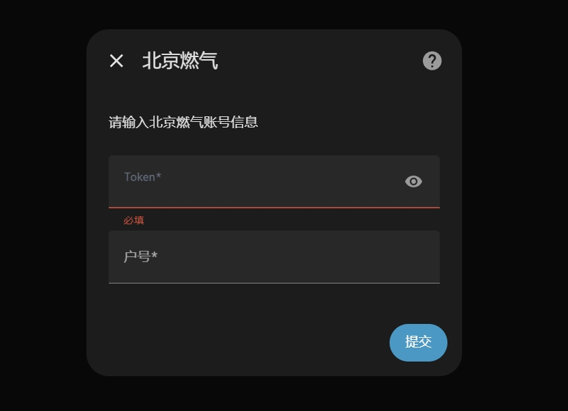
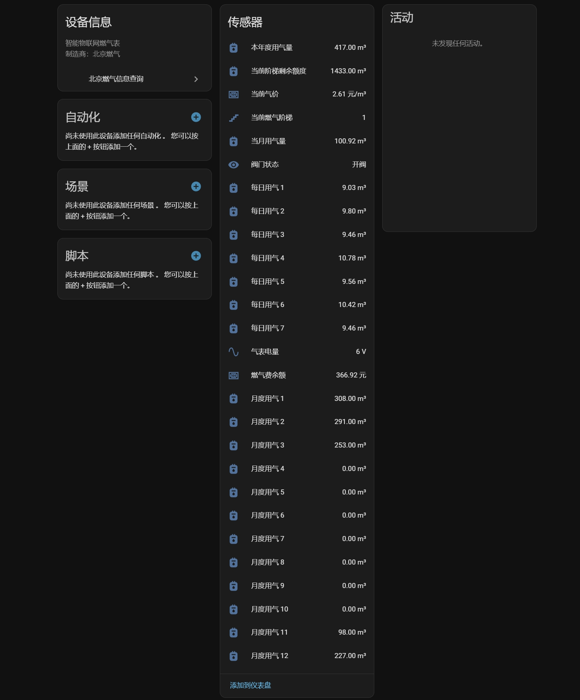

# 北京燃气信息查询（Home Assistant）

Home Assistant 自定义集成，用于从北京燃气接口获取账户余额、阶梯信息、用气统计等数据，并以 `sensor` 实体形式展示。

## 功能说明

- 支持通过 `Token + 户号` 接入单个燃气账户
- 自动拉取余额、当前阶梯、阶梯剩余额度、本月/本年用气量、阀门状态等信息
- 自动生成近一段时间的每日/每月历史用气实体
- 轮询更新周期：`10 分钟`

## 安装方式

### 方式一：HACS（推荐）

1. 在 HACS 中添加本仓库为自定义仓库（类别：`Integration`）。
2. 搜索并安装 `北京燃气信息查询`。
3. 重启 Home Assistant。

### 方式二：手动安装

1. 将 `custom_components/beijing-gas` 目录复制到 Home Assistant 的 `custom_components/` 目录下。
2. 重启 Home Assistant。

## 配置说明

进入 Home Assistant：

1. `设置 -> 设备与服务 -> 添加集成`
2. 搜索 `北京燃气`
3. 填写以下字段：
- `Token`：北京燃气接口授权令牌
- `户号`：燃气户号（`user_code`）

> 每个户号只允许配置一次；重复添加会被系统拦截。

## 认证流程

请按下图流程获取并填写 `Token` 与户号：

## 实体说明

集成会创建以下类型的实体：

- 汇总实体（固定）
  - `燃气费余额`
  - `当前燃气阶梯`
  - `当前气价`
  - `当前阶梯剩余额度`
  - `本年度用气量`
  - `当月用气量`
  - `气表电量`
  - `阀门状态`
- 历史实体（动态）
  - `月度用气 1..N`（附带月份、消费金额属性）
  - `每日用气 1..N`（附带日期属性）

实体示意图：

## 注意事项

- 本项目依赖北京燃气线上接口，若接口变更可能导致数据获取失败。
- `Token` 失效后需要在集成配置中更新。
- 若配置后无数据，优先检查 `Token`、`户号` 与网络连通性。
